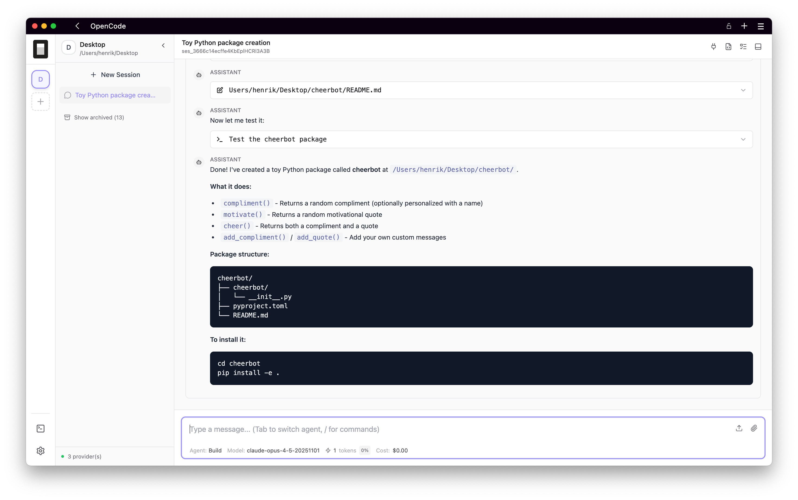

# pk-opencode-webui

Prefix-aware Web UI for [OpenCode](https://github.com/anomalyco/opencode). Works behind reverse proxies with URL path prefixes.



## Why This Project?

The official OpenCode web UI assumes it runs at the root path `/`. This breaks when deployed behind reverse proxies that add URL prefixes:

- `/notebook/namespace/name/` (Kubeflow Notebooks)
- `/proxy/8080/` (JupyterHub)
- `/apps/opencode/` (custom setups)

There's an [upstream PR](https://github.com/anomalyco/opencode/pull/7625) attempting to fix this with runtime regex patching, but it's hacky - fonts and other resources loaded via JavaScript still use hardcoded `/assets/` paths. With 1,500+ open PRs in the upstream repo, a proper fix is unlikely to be merged soon.

**This project is a reimplementation of the web UI only** - it connects to the standard `opencode serve` backend from the upstream project. Every URL, asset reference, and API call respects the configured prefix.

## Quick Start

### Prerequisites

This project uses [Bun](https://bun.sh) - a fast JavaScript runtime and package manager. Install it with:

```bash
# macOS / Linux
curl -fsSL https://bun.sh/install | bash

# Windows
powershell -c "irm bun.sh/install.ps1 | iex"

# Or via npm (if you have Node.js)
npm install -g bun
```

### Running

**1. Start the upstream OpenCode server** (in your project directory):

```bash
cd /your/project
opencode serve  # from the official OpenCode CLI
```

**2. Start the Web UI**:

```bash
cd app-prefixable
bun install && bun run dev
```

**3. Open** http://localhost:3000

## Configuration

| Variable        | Default                        | Description                        |
|-----------------|--------------------------------|------------------------------------|
| `BASE_PATH`     | `/`                            | URL prefix for the app             |
| `PORT`          | `3000` (dev) / `8080` (Docker) | Server port                        |
| `API_URL`       | `http://127.0.0.1:4096`        | OpenCode API URL                   |
| `BRANDING_NAME` | (empty)                        | Optional branding text shown in UI |
| `BRANDING_URL`  | (empty)                        | Optional URL for branding link     |

## Deployment

### Docker (Generic)

```bash
# Build
docker build -f docker/Dockerfile -t opencode-web .

# Run directly (no prefix)
docker run -p 8080:8080 \
  --add-host=host.docker.internal:host-gateway \
  -e API_URL=http://host.docker.internal:4096 \
  opencode-web
# Access at http://localhost:8080

# Run with prefix (requires reverse proxy in front)
docker run -p 8080:8080 \
  --add-host=host.docker.internal:host-gateway \
  -e API_URL=http://host.docker.internal:4096 \
  -e BASE_PATH=/apps/opencode/ \
  opencode-web
# Access via your reverse proxy at /apps/opencode/
```

See [docker/README.md](docker/README.md) for Docker Compose examples.

### Kubeflow Notebooks

A specialized image with s6-overlay, OpenCode CLI pre-installed, and automatic `NB_PREFIX` detection:

```bash
docker build -f docker/kubeflow/Dockerfile -t opencode-web-kubeflow .
```

See [docker/kubeflow/README.md](docker/kubeflow/README.md) for Kubeflow deployment details.

### Reverse Proxy Examples

See [examples/](examples/) for nginx, traefik, and other reverse proxy configurations.

## Building

```bash
cd app-prefixable
bun run build.ts
# Output in dist/
```

## Architecture

```
┌ ─ ─ ─ ─ ─ ─ ─ ─ ─ ─ ─ ─ ─ ─ ─ ─ ─ ─ ─ ─ ─ ─ ─ ─ ─ ─ ─ ─ ─ ─ ─ ─ ┐
  This Project
│                                                                   │
  ┌─────────────────────────────────────────────────────────────┐
│ │                         Browser                             │   │
  │  ┌───────────────────────────────────────────────────────┐  │
│ │  │                    SolidJS Frontend                   │  │   │
  │  │  - Session management                                 │  │
│ │  │  - Chat interface with streaming                      │  │   │
  │  │  - Review panel (git diffs)                           │  │
│ │  │  - Terminal emulator                                  │  │   │
  │  └───────────────────────────────────────────────────────┘  │
│ └─────────────────────────────────────────────────────────────┘   │
                                 │
│                    HTTP/SSE/WebSocket                             │
                                 ▼
│ ┌─────────────────────────────────────────────────────────────┐   │
  │                       UI Server (Bun)                       │
│ │  - Serves static files with correct base path               │   │
  │  - Proxies API requests to OpenCode server                  │
│ │  - Handles extended endpoints (/api/ext/*)                  │   │
  └─────────────────────────────────────────────────────────────┘
└ ─ ─ ─ ─ ─ ─ ─ ─ ─ ─ ─ ─ ─ ─ ─ ─ ─ ─ ─ ─ ─ ─ ─ ─ ─ ─ ─ ─ ─ ─ ─ ─ ┘
                                 │
                                 ▼
┌───────────────────────────────────────────────────────────────────┐
│          Upstream OpenCode Server (`opencode serve`)              │
│  - Session management                                             │
│  - LLM provider communication                                     │
│  - Tool execution (files, shell, MCP)                             │
│  - Terminal (PTY) management                                      │
└───────────────────────────────────────────────────────────────────┘
```

## Contributing

See [CONTRIBUTING.md](CONTRIBUTING.md)

## License

MIT - See [LICENSE](LICENSE)
