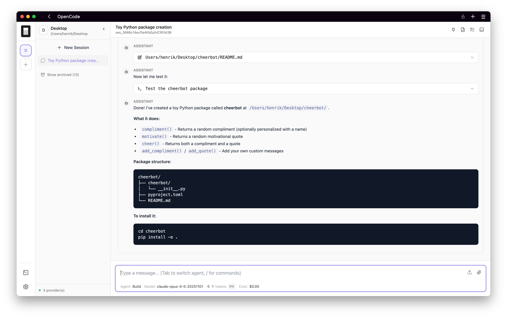

# pk-opencode-webui

A feature-rich, prefix-aware Web UI for [OpenCode](https://github.com/anomalyco/opencode). Designed to work behind reverse proxies and in Kubeflow Notebooks -- but runs great anywhere.



## Highlights

- **Full reverse proxy support** -- every URL, asset, and API call respects the configured base path
- **Multi-project workspace** -- switch between projects without restarting; each gets its own session
- **Multiple OpenCode servers** -- manage connections and keep session/draft tabs attached to their server
- **MCP server management** -- add, remove, connect, and disconnect MCP servers from the UI
- **Keyboard shortcuts** -- core navigation and panel shortcuts with an in-app reference
- **Manual session rename** -- keep session titles organized from the sidebar
- **Auto-accept permissions** -- skip confirmation dialogs for file edits on trusted projects
- **Custom branding** -- white-label with your own name, URL, and icon via environment variables
- **Kubeflow-native image** -- s6-overlay, PVC-aware home directory, SSH key fixing, rootless operation

## Why This Project?

The official OpenCode web UI assumes it runs at the root path `/`. This breaks behind reverse proxies that add URL prefixes:

- `/notebook/namespace/name/` (Kubeflow Notebooks)
- `/proxy/8080/` (JupyterHub)
- `/apps/opencode/` (custom setups)

There's an [upstream PR](https://github.com/anomalyco/opencode/pull/7625) attempting to fix this with runtime regex patching, but fonts and other resources loaded via JavaScript still use hardcoded `/assets/` paths. With 1,500+ open PRs in the upstream repo, a proper fix is unlikely to land soon.

**This project is a complete reimplementation of the web UI** -- it connects to the standard `opencode serve` backend. Every URL, asset reference, and API call respects the configured prefix. Along the way, we added a lot of features the upstream UI doesn't have.

## Feature Comparison

| Feature | Upstream OpenCode Web UI | pk-opencode-webui |
|---|---|---|
| Base path / prefix support | Hardcoded to `/` | Full runtime prefix detection |
| Reverse proxy support | Broken | Works out of the box (nginx, Traefik examples included) |
| Kubeflow integration | None | Full (NB_PREFIX, s6-overlay, jovyan user, PVC handling) |
| Multi-project support | Single project | Multiple projects with sidebar navigation |
| Project picker | None | Directory browser with fuzzy search, git clone, folder creation |
| MCP management UI | CLI only | Full graphical add/remove/connect/disconnect with OAuth support |
| Permission auto-accept | None | Per-directory toggle for trusted projects |
| Session rename | None | Manual sidebar rename |
| Keyboard shortcuts | Basic | Core navigation, panels, and shortcut reference |
| Custom branding | None | Name, URL, and icon via environment variables |
| Extended server API | None | Directory listing, mkdir, file write, MCP config deletion |
| Docker images | None | Generic (Alpine) and Kubeflow variants |
| Security hardening | Basic | Path traversal prevention, XSS escaping, rootless containers |

## Features In-Depth

### Multi-Project Workspace

Open multiple projects simultaneously. Each project directory is encoded in the URL, so you can bookmark or share links to specific sessions. The sidebar keeps project and session navigation available without restarting the server.

The **project picker** page offers:
- Recent projects list with relative timestamps
- Directory browser with fuzzy search and Tab-completion (shell-like)
- Inline folder creation
- Git clone with a live terminal showing progress

### MCP Server Management

Add and manage [Model Context Protocol](https://modelcontextprotocol.io/) servers directly from the UI:

- Connect/disconnect servers with toggle switches
- Add remote servers with URL, custom headers, and OAuth configuration
- Status indicators: Connected, Disabled, Failed, Needs Auth, Needs Registration
- Delete servers with confirmation
- RFC 7591 automatic client registration support

### Keyboard Workflow

Core shortcuts remain available for session navigation, project switching, sidebar and panel toggles, terminal access, and focus movement. Press `?` outside an input to open the shortcut reference. Sessions can be renamed manually from their sidebar menu.

### Auto-Accept Permissions

For trusted projects, enable **auto-accept** to automatically approve file edit and write permissions without confirmation dialogs. Toggled per-directory, persisted in localStorage, with a visual indicator in the session header.

### Settings

A full settings page with tabs for:

1. **Providers** -- configure API keys, run OAuth flows (including device code flow)
2. **Git** -- view SSH keys, configure Git settings
3. **MCP** -- manage MCP servers (see above)
4. **Instructions** -- edit project-level instruction files (AGENTS.md, etc.) with inline editor
5. **Project Config** -- edit project tools, permissions, and configuration
6. **Appearance** -- Light / Dark / System theme

The **Settings → Servers** page manages local and external OpenCode connections.
Session tabs show their server name; switching a
tab restores its own server, project, draft and settings scope.

### External OpenCode servers

1. Open **Settings → Servers** and choose **Add server**.
2. Enter the OpenCode API base URL and an optional display name.
3. Choose no authentication, username/password (default username: `opencode`),
   or a Bearer token. **Connect** checks `/global/health` before saving.
4. Open a discovered project or choose **New session**. Existing sessions and
   new-session drafts remain attached to their original server when switching tabs.

The workspace has no persistent server dropdown or connection-status header.
The tab strip offers a **+** action for new sessions. Missing connections or
credentials link to a backend-independent server settings page, so connection
management remains accessible even when the selected backend cannot be used.

For a personal prokube.ai sandbox, use its full published connect URL, for example
`https://cluster.example/svc/personal-sandbox/connect/workspace/sbx-id`, and a
key with that sandbox's `connect` permission. Provider credentials such as the
ChatGPT device-code login are managed by the selected OpenCode server separately.

Connection metadata and open tabs persist in browser localStorage. Passwords and
Bearer tokens are kept separately in sessionStorage for the current browser tab
session. After they expire or that browser session ends, edit the connection to
authenticate again. Removing a connection forgets its credential and tabs; it
does not delete sessions on the external server.

Native OpenCode APIs (sessions, providers, files, MCP connect/disconnect/add and
PTY terminals) use the selected server. Our filesystem-backed extensions
(`/api/ext/*`: saved prompts, direct file/config writes, directory creation and
MCP config removal) are local-only. Remote directory browsing uses OpenCode's
file API, and the UI marks local-only settings unavailable. Remote requests can
never fall back to the UI host's filesystem.

## Quick Start

### Prerequisites

This project uses [Bun](https://bun.sh) -- a fast JavaScript runtime and package manager:

```bash
# macOS / Linux
curl -fsSL https://bun.sh/install | bash

# Windows
powershell -c "irm bun.sh/install.ps1 | iex"

# Or via npm
npm install -g bun
```

### Running

**1. Start the upstream OpenCode server** (in your project directory):

```bash
cd /your/project
opencode serve  # from the official OpenCode CLI
```

**2. Start the Web UI**:

```bash
cd app-prefixable
bun install && bun run dev
```

**3. Open** http://localhost:3000

## Configuration

| Variable | Default | Description |
|---|---|---|
| `BASE_PATH` | `/` | URL prefix for the app |
| `BASE_PATH_STRIPPED` | `true` with `NB_PREFIX`, otherwise `false` | Set to `true` when the reverse proxy strips `BASE_PATH` before forwarding |
| `PORT` | `3000` (dev) / `8080` (Docker) | Server port |
| `API_URL` | `http://127.0.0.1:4096` | OpenCode API URL |
| `BRANDING_NAME` | _(empty)_ | Branding text shown as "Powered by {name}" |
| `BRANDING_URL` | _(empty)_ | URL for the branding link |
| `BRANDING_ICON` | _(empty)_ | Custom icon URL (HTTP, relative path, or data URI) |

### Connection and deployment model

Kubeflow or another authenticated ingress protects the UI and all its proxy and
`/api/ext/*` routes. Keep the built-in OpenCode backend private to the UI server.
External servers must be reachable from the UI server's network. The same-origin
relay preserves API URL prefixes, so browsers do not need remote CORS access.
Only explicitly configured remote credentials are forwarded; platform cookies,
JWTs and user-identity headers are stripped. Redirects are rejected instead of
forwarding credentials to a second destination.

External PTY WebSockets obtain a single-use, server/PTY-bound relay ticket via
an authenticated same-origin POST. Tickets expire after 30 seconds and contain
no credentials. The relay adds the remote Authorization header to the upstream
WebSocket handshake. As with local terminal access, server connection management
is intended for the authenticated owner of this UI deployment.

The connection list and server-bound session/draft tabs follow the upstream
[v1.18.33 server](https://github.com/anomalyco/opencode/blob/v1.18.33/packages/app/src/context/server.tsx)
and [tab](https://github.com/anomalyco/opencode/blob/v1.18.33/packages/app/src/context/tabs.tsx)
concepts. This implementation adapts them to our existing prefix-aware router,
same-origin relay and local extended API. It supports HTTP(S) connections; SSH
and desktop-sidecar transports belong to the upstream desktop application.

### Testing

In `app-prefixable/`:

```sh
bun install --frozen-lockfile
bun run typecheck
bun run lint
bun run test
node node_modules/playwright/cli.js install chromium
bun run test:browser
```

Browser tests run the production UI server against isolated local mock OpenCode
servers at root and notebook-prefixed URLs. They cover Basic authentication,
same-ID sessions on two servers, draft isolation, mutation routing, background
SSE, terminal WebSockets, reload, missing credentials and connection removal.
An installed Chrome binary can be selected with
`PLAYWRIGHT_CHROMIUM_EXECUTABLE_PATH` instead of downloading Chromium.

## Deployment

### Docker (Generic)

```bash
# Build
docker build -f docker/Dockerfile -t opencode-web .

# Run without prefix
docker run -p 8080:8080 \
  --add-host=host.docker.internal:host-gateway \
  -e API_URL=http://host.docker.internal:4096 \
  opencode-web
# Access at http://localhost:8080

# Run with a prefix preserved by the reverse proxy
docker run -p 8080:8080 \
  --add-host=host.docker.internal:host-gateway \
  -e API_URL=http://host.docker.internal:4096 \
  -e BASE_PATH=/apps/opencode/ \
  opencode-web
# Access via your reverse proxy at /apps/opencode/
```

Add `-e BASE_PATH_STRIPPED=true` when the reverse proxy removes `/apps/opencode` before forwarding the request to the UI server.

See [docker/README.md](docker/README.md) for Docker Compose examples.

### Kubeflow Notebooks

A specialized image with s6-overlay process supervision, OpenCode CLI pre-installed, developer tools (neovim, fzf, ripgrep), and automatic `NB_PREFIX` detection:

```bash
docker build -f docker/kubeflow/Dockerfile -t opencode-web-kubeflow .
```

Kubeflow-specific features:
- **PVC-aware home directory** -- copies template files without overwriting existing data
- **SSH key permission fixing** -- corrects permissions after PVC remount
- **Rootless operation** -- runs as `jovyan` (UID 1000), no SUID/SGID bits
- **Optional examples repo** -- clone a starter repo on first boot via `KF_EXAMPLES_REPO` build arg

See [docker/kubeflow/README.md](docker/kubeflow/README.md) for Kubeflow deployment details.

### Published Image Tags

Release tags must match `vX.Y.Z` or `vX.Y.Z-rcN`. Tag-triggered builds publish only that unchanged tag to `prokube/releases`; reruns skip an image that already exists. Manual builds publish `<nearest-git-tag>-<short-commit>`, `commit-<full-commit>`, and `latest` to `prokube/development`. All generated Docker tags must be valid and no longer than 128 characters.

### Reverse Proxy Examples

See [examples/](examples/) for nginx and Traefik configurations.

## Architecture

```
+------------------------------------------------------------------+
|  This Project                                                    |
|                                                                  |
|  +------------------------------------------------------------+  |
|  |  Browser                                                   |  |
|  |                                                            |  |
|  |  +------------------------------------------------------+  |  |
|  |  |  SolidJS Frontend                                    |  |  |
|  |  |                                                      |  |  |
|  |  |  - Multi-project session management                  |  |  |
|  |  |  - Chat interface with streaming                     |  |  |
|  |  |  - Review panel (git diffs)                          |  |  |
|  |  |  - Terminal emulator                                 |  |  |
|  |  |  - MCP server management                             |  |  |
|  |  |  - Keyboard shortcuts                                |  |  |
|  |  +------------------------------------------------------+  |  |
|  |                                                            |  |
|  +------------------------------------------------------------+  |
|                              |                                   |
|                  HTTP / SSE / WebSocket                          |
|                              v                                   |
|  +------------------------------------------------------------+  |
|  |  UI Server (Bun)                                           |  |
|  |                                                            |  |
|  |  - Serves static files with correct base path              |  |
|  |  - Proxies API requests to OpenCode server                 |  |
|  |  - Extended endpoints (/api/ext/mkdir, list-dirs, mcp)     |  |
|  |  - WebSocket proxy for PTY (terminal) sessions             |  |
|  +------------------------------------------------------------+  |
|                                                                  |
+------------------------------------------------------------------+
                               |
                               v
+------------------------------------------------------------------+
|  Upstream OpenCode Server (opencode serve)                       |
|                                                                  |
|  - Session management          - LLM provider communication      |
|  - Tool execution              - Terminal (PTY) management       |
+------------------------------------------------------------------+
```

## Building

```bash
cd app-prefixable
bun run build.ts
# Output in dist/
```

The build uses esbuild with the SolidJS plugin, PostCSS + Tailwind CSS, code splitting, and relative public paths (`./`) so assets resolve correctly under any prefix.

## Security

- **Path traversal prevention** -- all extended API endpoints validate paths and restrict operations to allowed directories
- **XSS prevention** -- base paths are HTML-escaped before DOM injection; config objects use `JSON.stringify`
- **URL validation** -- branding URLs are checked against `javascript:` and unsafe `data:` schemes
- **Rootless containers** -- Kubeflow image runs as non-root with all SUID/SGID bits removed
- **Workspace restriction** -- `OPENCODE_WORKSPACE_ROOT` limits filesystem operations to a defined boundary

## Contributing

See [CONTRIBUTING.md](CONTRIBUTING.md)

## License

MIT -- See [LICENSE](LICENSE)
